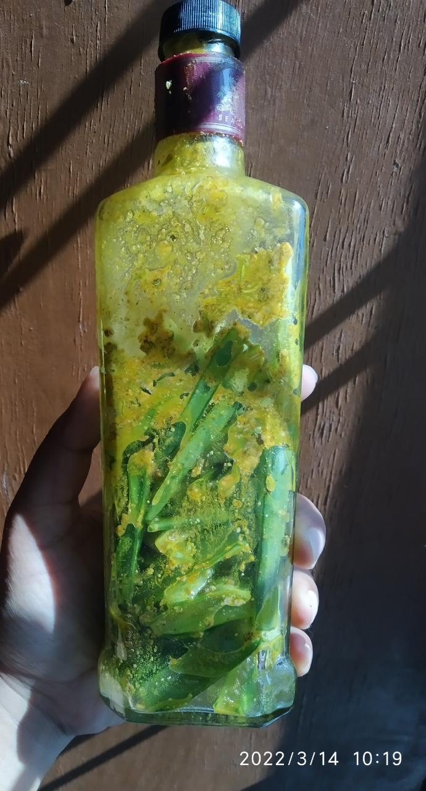
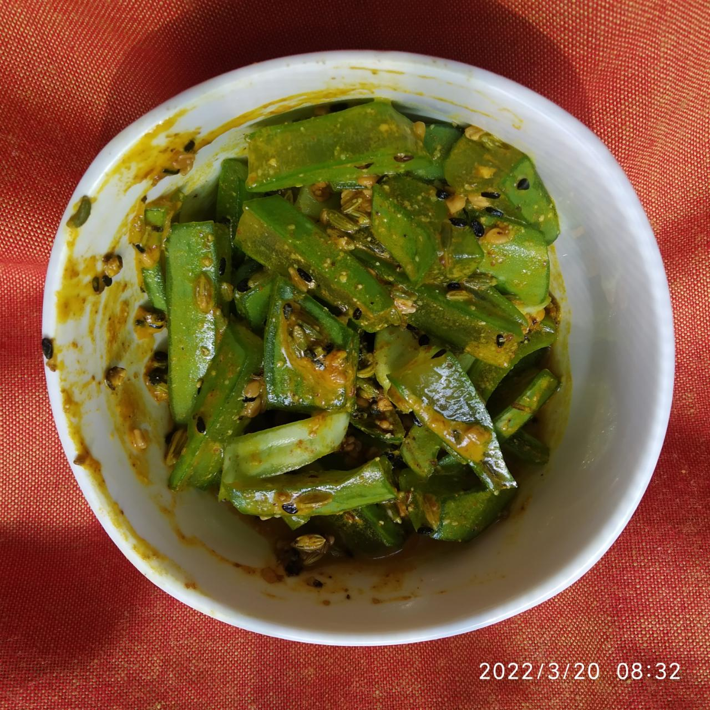
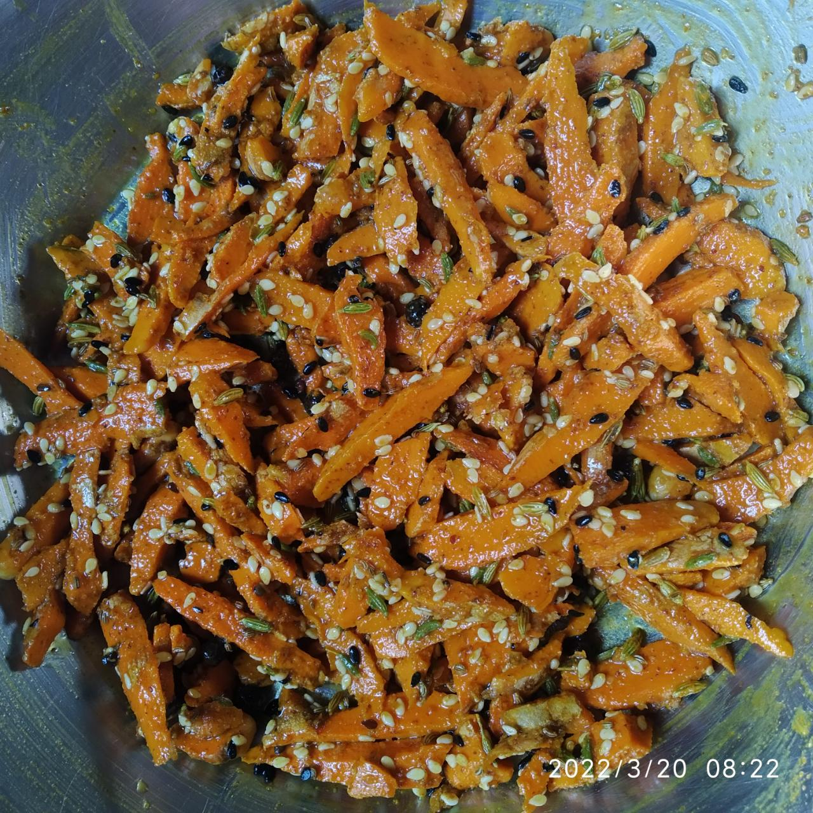
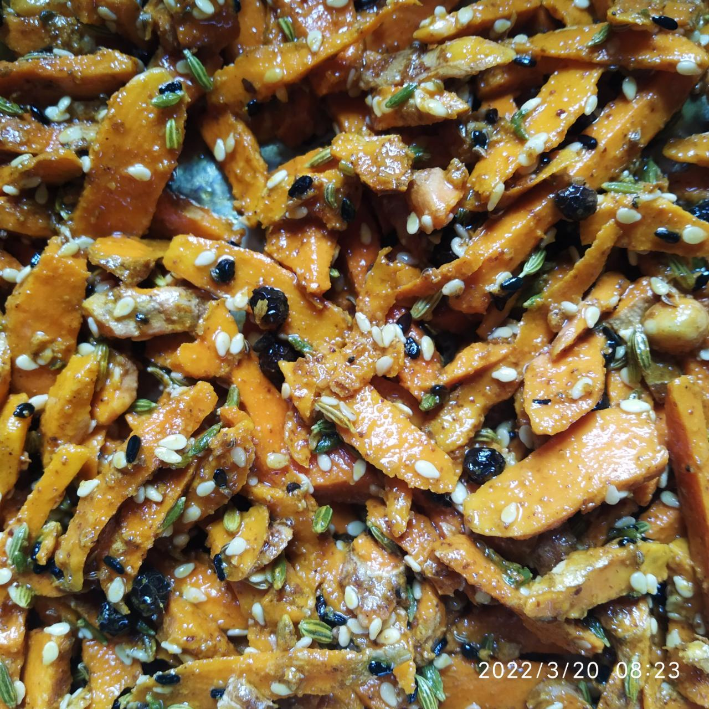
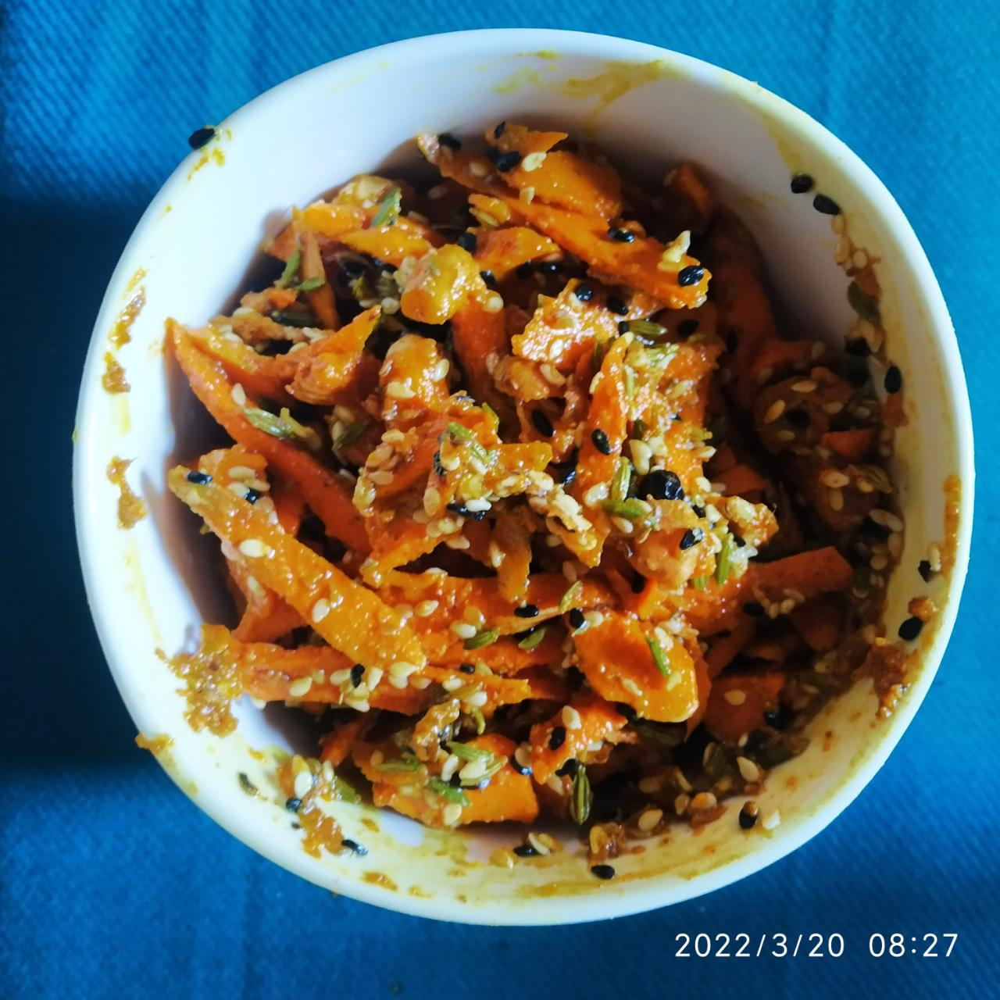

# Oil Base Pickles

## 2022

### 2022-03-14

**Raw Papaya Pickle**

- Raw papayas cleaned several times as they were picked up from road, then left for drying. 
- Once dried (after few hours) they are thinly sliced with peels (these are home papayas). 
- About 2-4 tea spoons of uncooked mustard oil, saunf, ajvain, turmeric powder, black pepper powder, heeng powder, salt (as per taste), rai powder added and mixed well. Ratios of spices put according to quantity. 
- Mixture added to glass bottle. Kept in sunlight. 

**Note:** Papayas picked up from road (sadly we had witnessed the tree being uprooted and thrown on road by the house owner as we were passing by). Photography background is also a [waste from road](https://nehalsin.github.io/zero-budget-life/)!

----

**Aloe Vera Pickle**

- Cleaned, dried, then thinly sliced into long pieces. 
- Uncooked mustard oil (just for coating), rai powder, heeng powder, saunf, very little ajvain, turmeric powder, black pepper powder and salt as per taste added and mixed well. 
- Gently added to the bottle. Kept in sunlight.

### 2022-03-20

**Aloe Vera Pickle** 

- Same as above recipe.
- Tried with slightly more mustard oil and kalaunji.

----

**Turmeric Pickle**

- Fine slices of turmeric mixed with sendha salt, mustard oil, saunf, heeng, methi dana, ajvain (very little), til (sesame seeds), kalaunji, black pepper powder. 
- Mixed thoroughly and put in Cheeni Mitti bowl with lid. 

----

### Insights

1. Don't over add salt. Quantity of pickle decreases as it gets slowly prepared.
2. Less oil required for thin slices as surface area increases, as compared to the ones with bigger slices. 
