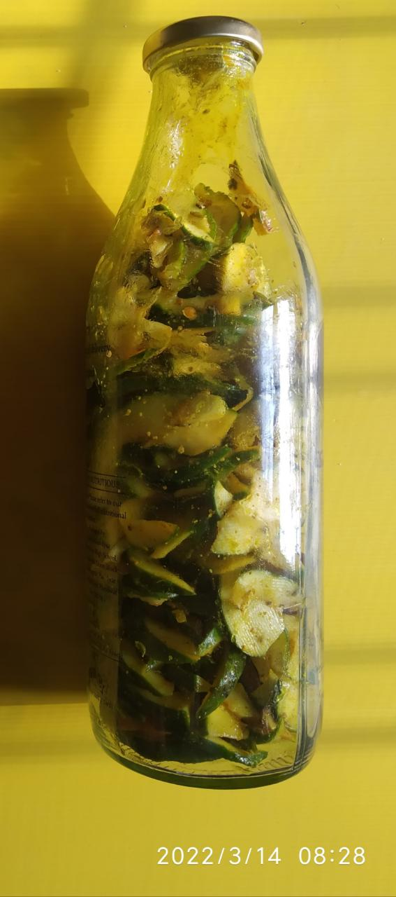

# Oil Base Pickles

## 2022

### 2022-03-14

**Raw Papaya Pickle**

- Raw papayas cleaned several times as they were picked up from road, then left for drying. 
- Once dried (after few hours) they are thinly sliced. 
- About 2-4 tea spoons of uncooked mustard oil, saunf, ajvain, turmeric powder, black pepper powder, heeng powder, salt (as per taste), rai powder added and mixed well. Ratios of spices put according to quantity. 
- Mixture added to glass bottle. Kept in sunlight. 

**Aloe Vera Pickle**

- Cleaned, dried, then thinly sliced into long pieces. 
- Uncooked mustard oil (just to layer the slices), rai powder, heeng powder, saunf, very little ajvain, turmeric powder, black pepper powder and salt as per taste added and mixed well. 
- Gently added to the bottle. Kept in sunlight.

### Insights

1. Don't over add salt. Quantity of pickle decreases as it gets slowly prepared.
2. Less oil required for thin slices as surface area increases, as compared to the ones with bigger slices. 
